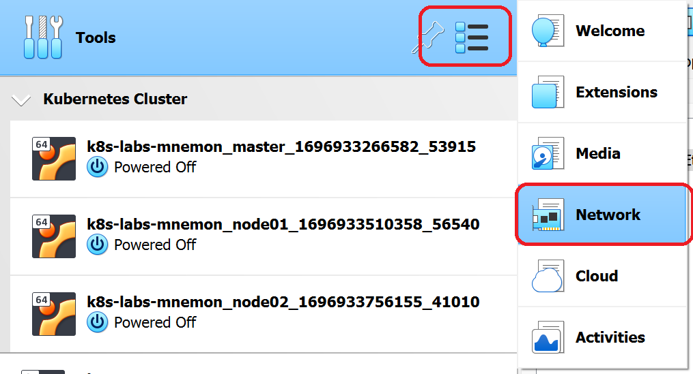
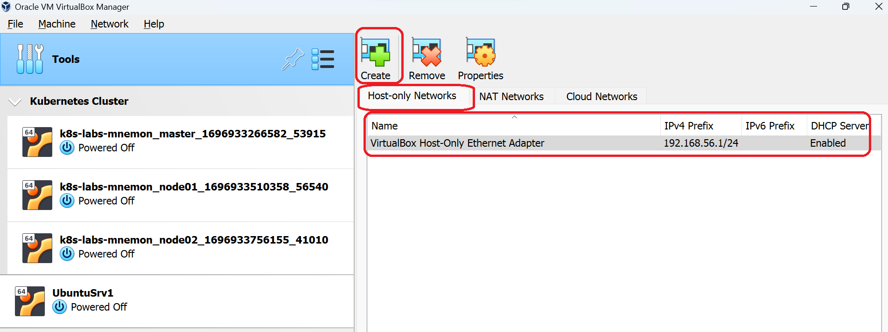

# Kubernetes Lab Instructions

## Getting this repo 

You can get this repository, either by downloading and installing git on your machine or downloading as a zip. Both the methods are shown below:

### Installing through git


1. **Install Git on your machine:** Download and install git for your machine by following the [official git documentation](https://git-scm.com/downloads)

2. **Clone This Repository:** Clone this repository to your machine by issuing:
```bash
git clone https://github.com/shounakacharya/k8s-labs-mnemon.git
```

### OR

### Downlad a zip of this repository

You can also download a zip of this repository from [this URL](https://github.com/shounakacharya/k8s-labs-mnemon/archive/refs/heads/master.zip)


## Download and Install Vagrant

1. Download the binary for your Operating System from [Vagrant Official Download Page](https://developer.hashicorp.com/vagrant/downloads)
2. Install the binary and verify installation as mentioned in [This Page](https://developer.hashicorp.com/vagrant/tutorials/getting-started/getting-started-install)

## Download and Install Oracle VirtualBox

1. Download VirtualBox for your Operating System from the [Official Oracle VirtualBox Page](https://www.virtualbox.org/wiki/Downloads)
2. Install VirtualBox
3. Open the VirtualBox application and Click on Tools -> Network as shown in the picture below:

4. This should open up a page on the right hand side as shown in the picture below:

5. Select the Host-only Networks as marked. You should see atleast 1 host only network as shown in the picture above. If there are no host only networks, you can create a host only network by clicking on the Create Button as marked in the diagram. 
6. It would be good to have only 1 host only network as the scripts are tested that way. Note down the subnet address of the Host Only Network: In this example we have:
    - 1 Host Only Network called **VirtualBox Host-Only Ethernet Adapter**
    - The IPv4 Prefix is 192.168.56.1/24. Thus the subnet is 192.168.56.0/24
    - DHCP Server is enabled on this network

## Boot up the K8s Cluster on Virtual Box

1. Make sure you are in the root directory of this repository

```bash
PS C:\Users\shoun\OneDrive\Documents\kubernetes> cd .\k8s-labs-mnemon\
PS C:\Users\shoun\OneDrive\Documents\kubernetes\k8s-labs-mnemon> pwd

Path
----
C:\Users\shoun\OneDrive\Documents\kubernetes\k8s-labs-mnemon


PS C:\Users\shoun\OneDrive\Documents\kubernetes\k8s-labs-mnemon>
```
Note the **k8s-labs-mnemon** at the end of the path

2. Open the settings.yaml in your favourite editor. Visual Studio Code or Notepad++ are preferred.
[Settings.yaml](./3-settings-yaml.png)

3. The Contents of the file should look like below:

```yaml
---
# cluster_name is used to group the nodes in a folder within VirtualBox:
cluster_name: Kubernetes Cluster
# Uncomment to set environment variables for services such as crio and kubelet.
# For example, configure the cluster to pull images via a proxy.
# environment: |
#   HTTP_PROXY=http://my-proxy:8000
#   HTTPS_PROXY=http://my-proxy:8000
#   NO_PROXY=127.0.0.1,localhost,master-node,node01,node02,node03
# All IPs/CIDRs should be private and allowed in /etc/vbox/networks.conf.
network:
  # Worker IPs are simply incremented from the control IP.
  control_ip: 192.168.56.20
  dns_servers:
    - 8.8.8.8
  pod_cidr: 172.16.1.0/16
  service_cidr: 172.17.1.0/18
nodes:
  control:
    cpu: 2
    memory: 4096
  workers:
    count: 2
    cpu: 1
    memory: 2048
# Mount additional shared folders from the host into each virtual machine.
# Note that the project directory is automatically mounted at /vagrant.
# shared_folders:
#   - host_path: ../images
#     vm_path: /vagrant/images
software:
  box: bento/ubuntu-22.04
  calico: 3.26.0
  # To skip the dashboard installation, set its version to an empty value or comment it out:
  dashboard: 2.7.0
  kubernetes: 1.27.1-00
  os: xUbuntu_22.04
```
Now, change the network -> control_ip value to the 20th IPv4 address from the IPv4 subnet Obtained in previous step from the HostOnly Network of the Virtual Box. For example:

In this case, my IPv4 prefix was 192.168.56.1/24 and hence the subnet is 192.168.56.0/24. The control_ip is the IP of the VM which would host the Master Node of Kubernetes. In this case it would be 192.168.56.20. Henceforth, all the worker nodes will have an IP with one increment from the previous one. So if I have two worker nodes, I will have IPs as 192.168.56.21 for worker 1 and 192.168.56.22 for worker 2.

So for example, you got 192.168.60.1/24, then set the control_ip to 192.168.60.20.

4. You can also change the number of workers and the amount of resources per VM as well. It is good to go with the values here. Here we have 2 worker nodes specified in the setting nodes -> workers -> count.

5. Now issue the command `vagrant up` as shown below

```bash
PS C:\Users\shoun\OneDrive\Documents\kubernetes\k8s-labs-mnemon> vagrant up
```

This may take upto 15-20 minutes to provision the VMs and create the K8s cluster.

6. Login to the master node with the following command:

```bash
PS C:\Users\shoun\OneDrive\Documents\kubernetes\k8s-labs-mnemon> vagrant ssh master
```

7. You would be logged in to the master and will get the bash prompt

```bash
Welcome to Ubuntu 22.04.2 LTS (GNU/Linux 5.15.0-67-generic x86_64)

 * Documentation:  https://help.ubuntu.com
 * Management:     https://landscape.canonical.com
 * Support:        https://ubuntu.com/advantage

  System information as of Wed Oct 11 05:02:40 AM UTC 2023

  System load:  0.576171875        Users logged in:        0
  Usage of /:   19.1% of 30.34GB   IPv4 address for eth0:  10.0.2.15
  Memory usage: 21%                IPv4 address for eth1:  192.168.56.20
  Swap usage:   0%                 IPv4 address for tunl0: 172.16.77.128
  Processes:    177

 * Introducing Expanded Security Maintenance for Applications.
   Receive updates to over 25,000 software packages with your
   Ubuntu Pro subscription. Free for personal use.

     https://ubuntu.com/pro


This system is built by the Bento project by Chef Software
More information can be found at https://github.com/chef/bento
Last login: Tue Oct 10 10:38:49 2023 from 10.0.2.2
vagrant@master-node:~$
```

8. Issue a kubectl command to verify Kubernetes cluster is formed and working:

```bash
vagrant@master-node:~$ kubectl get nodes -o wide
NAME            STATUS   ROLES           AGE   VERSION   INTERNAL-IP     EXTERNAL-IP   OS-IMAGE             KERNEL-VERSION      CONTAINER-RUNTIME
master-node     Ready    control-plane   18h   v1.27.1   192.168.56.20   <none>        Ubuntu 22.04.2 LTS   5.15.0-67-generic   cri-o://1.27.1
worker-node01   Ready    worker          18h   v1.27.1   192.168.56.21   <none>        Ubuntu 22.04.2 LTS   5.15.0-67-generic   cri-o://1.27.1
worker-node02   Ready    worker          18h   v1.27.1   192.168.56.22   <none>        Ubuntu 22.04.2 LTS   5.15.0-67-generic   cri-o://1.27.1
vagrant@master-node:~$
```

9. Run a new Pod and verify it is getting created:

```bash
vagrant@master-node:~$ kubectl run nginx-pod --image=nginx
pod/nginx-pod created
vagrant@master-node:~$ kubectl get pods
NAME                READY   STATUS    RESTARTS   AGE
nginx-pod           1/1     Running   0          10s
vagrant@master-node:~$
```

10. Delete the Pod:

```bash
vagrant@master-node:~$ kubectl delete pod nginx-pod
pod "nginx-pod" deleted
vagrant@master-node:~$
```

11. Exit the SSH session by typing in `exit`

```bash
vagrant@master-node:~$ exit
```

12. You are back to the host machine prompt. Halt the cluster so that the cluster does not need to be re-installed and can be re-used later..

```bash
PS C:\Users\shoun\OneDrive\Documents\kubernetes\k8s-labs-mnemon> vagrant halt
==> node02: Attempting graceful shutdown of VM...
==> node01: Attempting graceful shutdown of VM...
==> master: Attempting graceful shutdown of VM...
PS C:\Users\shoun\OneDrive\Documents\kubernetes\k8s-labs-mnemon>
```
