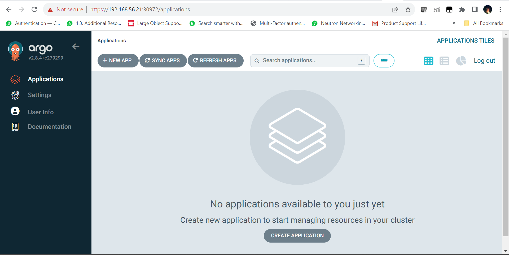

# Argo CD Installation and Sample Application Lab

Open a shell in your host machine and navigate to the root directory of this repository from where you ssh to the master node previously. You should be in the `k8s-labs-mnemon` directory. From this directory issue the following commands to get the names of the booted nodes

```bash
PS C:\Users\shoun\OneDrive\Documents\kubernetes\k8s-labs-mnemon> vagrant status
Current machine states:

master                    running (virtualbox)
node01                    running (virtualbox)
node02                    running (virtualbox)

This environment represents multiple VMs. The VMs are all listed
above with their current state. For more information about a specific
VM, run `vagrant status NAME`.
PS C:\Users\shoun\OneDrive\Documents\kubernetes\k8s-labs-mnemon>
```

As we can see we have a 3 node cluster. 1 master and 2 worker nodes

Now from the the shell ssh to the master node:

```bash
PS C:\Users\shoun\OneDrive\Documents\kubernetes\k8s-labs-mnemon> vagrant ssh master
Welcome to Ubuntu 22.04.2 LTS (GNU/Linux 5.15.0-67-generic x86_64)

 * Documentation:  https://help.ubuntu.com
 * Management:     https://landscape.canonical.com
 * Support:        https://ubuntu.com/advantage

  System information as of Thu Oct 12 03:49:22 PM UTC 2023

  System load:  1.01416015625      Users logged in:        0
  Usage of /:   19.5% of 30.34GB   IPv4 address for eth0:  10.0.2.15
  Memory usage: 23%                IPv4 address for eth1:  192.168.56.20
  Swap usage:   0%                 IPv4 address for tunl0: 172.16.77.128
  Processes:    182

 * Introducing Expanded Security Maintenance for Applications.
   Receive updates to over 25,000 software packages with your
   Ubuntu Pro subscription. Free for personal use.

     https://ubuntu.com/pro


This system is built by the Bento project by Chef Software
More information can be found at https://github.com/chef/bento
Last login: Thu Oct 12 12:42:29 2023 from 10.0.2.2
vagrant@master-node:~$
```

## Install Argo CD

1. We would first create a namespace called as argocd where the ArgoCD application will reside. Please note that the namespace has to be created with the same name as this namespace name is hardcoded in the manifests to deploy the ArgoCD application.

```bash
vagrant@master-node:~$ kubectl create namespace argocd
namespace/argocd created
vagrant@master-node:~$
```

```bash
vagrant@master-node:~$ kubectl apply -n argocd -f https://raw.githubusercontent.com/argoproj/argo-cd/stable/manifests/install.yaml
customresourcedefinition.apiextensions.k8s.io/applications.argoproj.io created
customresourcedefinition.apiextensions.k8s.io/applicationsets.argoproj.io created
customresourcedefinition.apiextensions.k8s.io/appprojects.argoproj.io created
serviceaccount/argocd-application-controller created
serviceaccount/argocd-applicationset-controller created
serviceaccount/argocd-dex-server created
serviceaccount/argocd-notifications-controller created
serviceaccount/argocd-redis created
serviceaccount/argocd-repo-server created
serviceaccount/argocd-server created
role.rbac.authorization.k8s.io/argocd-application-controller created
role.rbac.authorization.k8s.io/argocd-applicationset-controller created
role.rbac.authorization.k8s.io/argocd-dex-server created
role.rbac.authorization.k8s.io/argocd-notifications-controller created
role.rbac.authorization.k8s.io/argocd-server created
clusterrole.rbac.authorization.k8s.io/argocd-application-controller created
clusterrole.rbac.authorization.k8s.io/argocd-server created
rolebinding.rbac.authorization.k8s.io/argocd-application-controller created
rolebinding.rbac.authorization.k8s.io/argocd-applicationset-controller created
rolebinding.rbac.authorization.k8s.io/argocd-dex-server created
rolebinding.rbac.authorization.k8s.io/argocd-notifications-controller created
rolebinding.rbac.authorization.k8s.io/argocd-server created
clusterrolebinding.rbac.authorization.k8s.io/argocd-application-controller created
clusterrolebinding.rbac.authorization.k8s.io/argocd-server created
configmap/argocd-cm created
configmap/argocd-cmd-params-cm created
configmap/argocd-gpg-keys-cm created
configmap/argocd-notifications-cm created
configmap/argocd-rbac-cm created
configmap/argocd-ssh-known-hosts-cm created
configmap/argocd-tls-certs-cm created
secret/argocd-notifications-secret created
secret/argocd-secret created
service/argocd-applicationset-controller created
service/argocd-dex-server created
service/argocd-metrics created
service/argocd-notifications-controller-metrics created
service/argocd-redis created
service/argocd-repo-server created
service/argocd-server created
service/argocd-server-metrics created
deployment.apps/argocd-applicationset-controller created
deployment.apps/argocd-dex-server created
deployment.apps/argocd-notifications-controller created
deployment.apps/argocd-redis created
deployment.apps/argocd-repo-server created
deployment.apps/argocd-server created
statefulset.apps/argocd-application-controller created
networkpolicy.networking.k8s.io/argocd-application-controller-network-policy created
networkpolicy.networking.k8s.io/argocd-applicationset-controller-network-policy created
networkpolicy.networking.k8s.io/argocd-dex-server-network-policy created
networkpolicy.networking.k8s.io/argocd-notifications-controller-network-policy created
networkpolicy.networking.k8s.io/argocd-redis-network-policy created
networkpolicy.networking.k8s.io/argocd-repo-server-network-policy created
networkpolicy.networking.k8s.io/argocd-server-network-policy created
vagrant@master-node:~$
```

2. Check the status of all the pods in ArgoCD. They should be all in a running statge with 1/1 as shown below:

```bash
vagrant@master-node:~$ kubectl get po -n argocd
NAME                                                READY   STATUS    RESTARTS        AGE
argocd-application-controller-0                     1/1     Running   0               8m2s
argocd-applicationset-controller-787bfd9669-v8kfm   1/1     Running   0               8m2s
argocd-dex-server-bb76f899c-gsn77                   1/1     Running   0               4m21s
argocd-notifications-controller-5557f7bb5b-nklvx    1/1     Running   0               8m2s
argocd-redis-b5d6bf5f5-bjwhp                        1/1     Running   0               8m2s
argocd-repo-server-56998dcf9c-ggkrl                 1/1     Running   2 (3m1s ago)    8m2s
argocd-server-5985b6cf6f-tl7mc                      1/1     Running   2 (3m30s ago)   8m2s
vagrant@master-node:~$
```

2. Patch the argocd-server service to a type NodePort so that the browsers in our machine can access it.

```bash
vagrant@master-node:~$ kubectl patch svc argocd-server -n argocd -p '{"spec": {"type": "NodePort"}}'
service/argocd-server patched
vagrant@master-node:~$
```
and then confirm and note the NodePort for the ArgoCD server
```bash
vagrant@master-node:~$ kubectl get svc argocd-server -n argocd
NAME            TYPE       CLUSTER-IP      EXTERNAL-IP   PORT(S)                      AGE
argocd-server   NodePort   172.17.21.224   <none>        80:30972/TCP,443:31991/TCP   11m
vagrant@master-node:~$
```
In this case the ArgoCD UI should be accessible on port 30972 from the browser of the host machine

2. Download and install the ArgoCD CLI tool:

```bash
vagrant@master-node:~$ curl -sSL -o argocd-linux-amd64 https://github.com/argoproj/argo-cd/releases/latest/download/argocd-linux-amd64
vagrant@master-node:~$ ls -ltr
total 248
drwxr-x--- 6 vagrant vagrant   4096 Sep  1 15:14 istio-1.19.0
-rw-r--r-- 1 root    root    244734 Oct  5 06:02 calico.yaml
-rw-rw-r-- 1 vagrant vagrant      9 Oct  5 07:55 argocd-linux-amd64
vagrant@master-node:~$ sudo install -m 555 argocd-linux-amd64 /usr/local/bin/argocd
vagrant@master-node:~$ rm argocd-linux-amd64
vagrant@master-node:~$
```

3. The initial password for the `admin` account is auto-generated and stored as clear text in the field password in a secret named `argocd-initial-admin-secret` in your Argo CD installation namespace. You can simply retrieve this password using the argocd CLI:

```bash
vagrant@master-node:~$ argocd admin initial-password -n argocd
tP6eeTuZTsdlas7e

 This password must be only used for first time login. We strongly recommend you update the password using `argocd account update-password`.
vagrant@master-node:~$
```

In this case the password is `tP6eeTuZTsdlas7e`

4. Using the argocd cli login to the argocd API server. Please note that the hostname and port combination used in the command below is the IP of the first worker node and the NodePort obtained after patching the argocd-server service

```bash
vagrant@master-node:~$ argocd login 192.168.56.21:30972
WARNING: server certificate had error: tls: failed to verify certificate: x509: cannot validate certificate for 192.168.56.21 because it doesn't contain any IP SANs. Proceed insecurely (y/n)? y
Username: admin
Password:
'admin:login' logged in successfully
Context '192.168.56.21:30972' updated
vagrant@master-node:~$
```

Also note the username is `admin` and the password is the initial password obtained in the previous step. In this case it was `tP6eeTuZTsdlas7e`

5. Change the password to something else using the below command. Please make sure to note down the password which would be used subsequently in the UI login steps

```bash
vagrant@master-node:~$ argocd account update-password
*** Enter password of currently logged in user (admin):
*** Enter new password for user admin:
*** Confirm new password for user admin:
Password updated
Context '192.168.56.21:30972' updated
vagrant@master-node:~$
```

## Creating ArgoCD Apps

We would be using the ArgoCD UI to create an Application on ArgoCD. We can do the same with the CLI as well. However, for this lab, we would do it via the UI.

1. Go to the ArgoCD Webpage by typing in the hostname:port combination we figured out earlier. In this case it was `192.168.56.21:30972`. It would through a insecure certificate error as we are using the self-signed certificates. Accept the risk and proceed. Put the username as `admin` and password as the updated password created in the previous step. After a successful login, you would be on the page as shown in the below screenshot:


2. Click on the New App button and fill in the form with the details as below:

Application Name: guestbook
Project Name: default
Repository URL: https://github.com/argoproj/argocd-example-apps.git
Revision: HEAD
Path: guestbook
Cluster URL: https://kubernetes.default.svc
Namespace: default

And then Click the Create Button

3. After this you will get a page mentioning your application. Click on Sync and on the pop-up click on synchronize as shown below:


4. After a successful Sync the App is shown as healthy as shown below:


5. Play around with ArgoCD console by clicking on the Application page and exploring the various options.