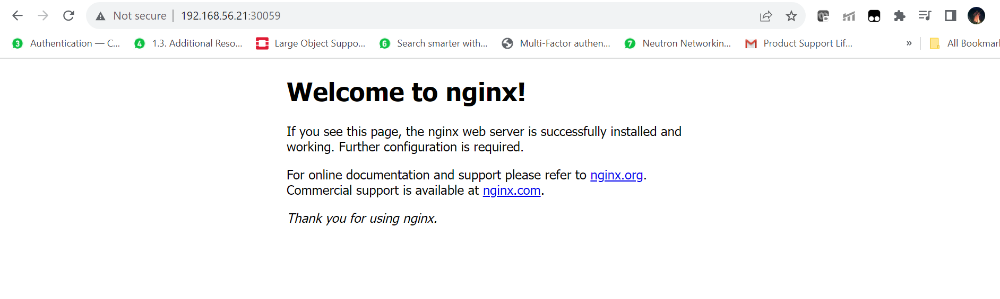
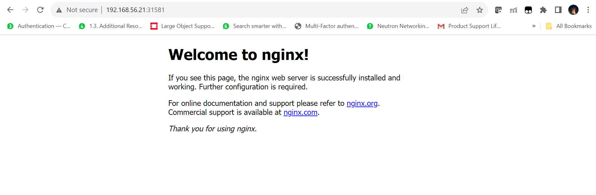

# Networking

In this lab we would be working with the following Networking Components:
1. CluserIP Service
2. NodePort Service
3. Ingress

Before Executing anything further, let's remove all the ResourceQuotas and LimitRanges that we applied in the Previous Lab. Please execute the following commands, only if the exist. Else, you can jump to the ClusterIP Portion

```bash
vagrant@master-node:~$ kubectl describe ns default
Name:         default
Labels:       kubernetes.io/metadata.name=default
Annotations:  <none>
Status:       Active

Resource Quotas
  Name:          project-quota
  Resource       Used  Hard
  --------       ---   ---
  limits.cpu     0     1
  limits.memory  0     1Gi
  pods           5     10

Resource Limits
 Type       Resource  Min  Max    Default Request  Default Limit  Max Limit/Request Ratio
 ----       --------  ---  ---    ---------------  -------------  -----------------------
 Container  cpu       0    200m   100m             100m           -
 Container  memory    0    512Mi  256Mi            256Mi          -
vagrant@master-node:~$ kubectl get resourcequota
NAME            AGE   REQUEST      LIMIT
project-quota   22h   pods: 5/10   limits.cpu: 0/1, limits.memory: 0/1Gi
vagrant@master-node:~$ kubectl delete resourcequota project-quota
resourcequota "project-quota" deleted
vagrant@master-node:~$ kubectl get limitranges
NAME                     CREATED AT
container-limit-ranges   2023-10-10T14:41:53Z
vagrant@master-node:~$ kubectl delete limitranges container-limit-ranges
limitrange "container-limit-ranges" deleted
vagrant@master-node:~$
```

## ClusterIP Service

1. Execute the following command to create a new pod called the nginx-pod:

```bash
vagrant@master-node:~$ kubectl run nginx-pod --image=nginx
pod/nginx-pod created
vagrant@master-node:~$
```

2. Check whether the Pod is created successfully by executing the following command:

```bash
vagrant@master-node:~$ kubectl get po -o wide -l run=nginx-pod
NAME        READY   STATUS    RESTARTS   AGE     IP              NODE            NOMINATED NODE   READINESS GATES
nginx-pod   1/1     Running   0          5m38s   172.16.158.49   worker-node02   <none>           <none>
vagrant@master-node:~$
```

3. Observe the cluster-ip.yaml file:

```yaml
apiVersion: v1
kind: Service
metadata:
  creationTimestamp: null
  labels:
    run: nginx-pod-clusterip
  name: nginx-pod-clusterip
spec:
  type: ClusterIP
  ports:
  - port: 8080
    protocol: TCP
    targetPort: 80
  selector:
    run: nginx-pod
```

Create the Service by executing the following command:

```bash
vagrant@master-node:~$ kubectl create -f cluster-ip.yaml
service/nginx-pod-clusterip created
vagrant@master-node:~$
```

4. Check whether the service is created successfully

```bash
vagrant@master-node:~$ kubectl get svc
NAME                  TYPE        CLUSTER-IP     EXTERNAL-IP   PORT(S)    AGE
kubernetes            ClusterIP   172.17.0.1     <none>        443/TCP    26h
nginx-pod-clusterip   ClusterIP   172.17.20.67   <none>        8080/TCP   6s
vagrant@master-node:~$
```

5. Check the details of the service. Notice the Endpoints field which has the IP address of the Pod.

```bash
vagrant@master-node:~$ kubectl describe svc nginx-pod-clusterip
Name:              nginx-pod-clusterip
Namespace:         default
Labels:            run=nginx-pod-clusterip
Annotations:       <none>
Selector:          run=nginx-pod
Type:              ClusterIP
IP Family Policy:  SingleStack
IP Families:       IPv4
IP:                172.17.20.67
IPs:               172.17.20.67
Port:              <unset>  8080/TCP
TargetPort:        80/TCP
Endpoints:         172.16.158.49:80
Session Affinity:  None
Events:            <none>
vagrant@master-node:~$
```

We can also get the backend pod details by executing the following command:

```bash
vagrant@master-node:~$ kubectl get endpoints nginx-pod-clusterip
NAME                  ENDPOINTS          AGE
nginx-pod-clusterip   172.16.158.49:80   5m8s
vagrant@master-node:~$
```

6. Execute the following command, which boots a busybox Pod in the cluster and would be used access the service:

```bash
vagrant@master-node:~$ kubectl run busybox --image=busybox -- sleep 3600
pod/busybox created
vagrant@master-node:~$ kubectl get po -l run=busybox
NAME      READY   STATUS    RESTARTS   AGE
busybox   1/1     Running   0          17s
vagrant@master-node:~$
```

7. We will login into the Pod and try and access the service. Execute the following commands:

```bash
vagrant@master-node:~$ kubectl exec -it busybox -- sh
/ # wget -O - 172.17.20.67:8080
Connecting to 172.17.20.67:8080 (172.17.20.67:8080)
writing to stdout
<!DOCTYPE html>
<html>
<head>
<title>Welcome to nginx!</title>
<style>
html { color-scheme: light dark; }
body { width: 35em; margin: 0 auto;
font-family: Tahoma, Verdana, Arial, sans-serif; }
</style>
</head>
<body>
<h1>Welcome to nginx!</h1>
<p>If you see this page, the nginx web server is successfully installed and
working. Further configuration is required.</p>

<p>For online documentation and support please refer to
<a href="http://nginx.org/">nginx.org</a>.<br/>
Commercial support is available at
<a href="http://nginx.com/">nginx.com</a>.</p>

<p><em>Thank you for using nginx.</em></p>
</body>
</html>
-                    100% |*************************************************************************************|   615  0:00:00 ETA
written to stdout
/ # exit
vagrant@master-node:~$
```

As we see, we are able to hit the nginx service from within the cluster. Now let's expose it outside the cluster using NodePorts

## NodePort Service

Consider the file nodeport.yaml

```yaml
apiVersion: v1
kind: Service
metadata:
  creationTimestamp: null
  labels:
    run: nginx-pod-np
  name: nginx-pod-np
spec:
  type: NodePort
  ports:
  - port: 8080
    protocol: TCP
    targetPort: 80
  selector:
    run: nginx-pod
```

Let's create the Service and get the details

```bash
vagrant@master-node:~$ kubectl create -f nodeport.yaml
service/nginx-pod-np created
vagrant@master-node:~$ kubectl get service
NAME                  TYPE        CLUSTER-IP      EXTERNAL-IP   PORT(S)          AGE
kubernetes            ClusterIP   172.17.0.1      <none>        443/TCP          27h
nginx-pod-clusterip   ClusterIP   172.17.20.67    <none>        8080/TCP         19m
nginx-pod-np          NodePort    172.17.50.138   <none>        8080:30059/TCP   10s
vagrant@master-node:~$
```

As we see that the Port on the worker nodes that was created was 30059. Let's access it from the host browser byt typing `http://192.168.56.21:30059` where `192.168.56.21` is the IP address of the first worker node.

It should result in the output as shown in the following picture:



## Ingress

In this lab we would be using the Nginx Ingress Controller distributed by Kubernetes community. 

1. Issue the following command to install the nginx kubernetes controller

```bash
vagrant@master-node:~$ kubectl apply -f https://raw.githubusercontent.com/kubernetes/ingress-nginx/controller-v1.8.2/deploy/static/provider/baremetal/deploy.yaml
namespace/ingress-nginx created
serviceaccount/ingress-nginx created
serviceaccount/ingress-nginx-admission created
role.rbac.authorization.k8s.io/ingress-nginx created
role.rbac.authorization.k8s.io/ingress-nginx-admission created
clusterrole.rbac.authorization.k8s.io/ingress-nginx created
clusterrole.rbac.authorization.k8s.io/ingress-nginx-admission created
rolebinding.rbac.authorization.k8s.io/ingress-nginx created
rolebinding.rbac.authorization.k8s.io/ingress-nginx-admission created
clusterrolebinding.rbac.authorization.k8s.io/ingress-nginx created
clusterrolebinding.rbac.authorization.k8s.io/ingress-nginx-admission created
configmap/ingress-nginx-controller created
service/ingress-nginx-controller created
service/ingress-nginx-controller-admission created
deployment.apps/ingress-nginx-controller created
job.batch/ingress-nginx-admission-create created
job.batch/ingress-nginx-admission-patch created
ingressclass.networking.k8s.io/nginx created
validatingwebhookconfiguration.admissionregistration.k8s.io/ingress-nginx-admission created
vagrant@master-node:~$
```

This creates a namespace called ingress-nginx and deploys all resources there. 

2. Check and wait till the Nginx Ingress Controller Pod is running:

```bash
vagrant@master-node:~$ kubectl get po -n ingress-nginx
NAME                                        READY   STATUS      RESTARTS   AGE
ingress-nginx-admission-create-swvgh        0/1     Completed   0          37s
ingress-nginx-admission-patch-gn2jd         0/1     Completed   0          37s
ingress-nginx-controller-79bc9f5df8-hjxsm   1/1     Running     0          37s
vagrant@master-node:~$
```

3. Check the NodePorts allocated to the Nginx Ingress Controller Service

```bash
vagrant@master-node:~$ kubectl get svc -n ingress-nginx
NAME                                 TYPE        CLUSTER-IP      EXTERNAL-IP   PORT(S)                      AGE
ingress-nginx-controller             NodePort    172.17.3.89     <none>        80:31581/TCP,443:31384/TCP   53s
ingress-nginx-controller-admission   ClusterIP   172.17.12.219   <none>        443/TCP                      53s
vagrant@master-node:~$
```
As we can see that all http requests are mapped to NodePort 31581 and all https requests are mapped to 31384

4. Let's create an ingress resource to map the ingress to our nginx service we created earlier. Consider the ingress.yaml file given below:

```yaml
apiVersion: networking.k8s.io/v1
kind: Ingress
metadata:
  name: nginx-pod-ingress
  namespace: default
spec:
  ingressClassName: nginx
  rules:
  - http:
      paths:
      - pathType: Prefix
        path: /
        backend:
          service:
            name: nginx-pod-clusterip
            port:
              number: 8080
```
This rule forwards all packets received by the nginx ingress to the nginx-pod-clusterip service created earlier

Create the ingress resource and check if it is created successfully:

```bash
vagrant@master-node:~$ kubectl create -f ingress.yaml
ingress.networking.k8s.io/nginx-pod-ingress created
vagrant@master-node:~$ kubectl get ingress
NAME                CLASS   HOSTS   ADDRESS   PORTS   AGE
nginx-pod-ingress   nginx   *                 80      6s
vagrant@master-node:~$
```

As we see that the Port on the worker nodes that was created for the nginx ingress service was 31581 for http traffic. Let's access it from the host browser byt typing `http://192.168.56.21:31581` where `192.168.56.21` is the IP address of the first worker node.

It should result in the output as shown in the following picture:




## Cleaning Up

Issue the following commands to delete all the services and pods that were created in this lab

```bash
vagrant@master-node:~$ kubectl delete ingress nginx-pod-ingress
ingress.networking.k8s.io "nginx-pod-ingress" deleted
vagrant@master-node:~$ kubectl delete svc nginx-pod-clusterip nginx-pod-np
service "nginx-pod-clusterip" deleted
service "nginx-pod-np" deleted
vagrant@master-node:~$ kubectl delete po nginx-pod
pod "nginx-pod" deleted
vagrant@master-node:~$
```