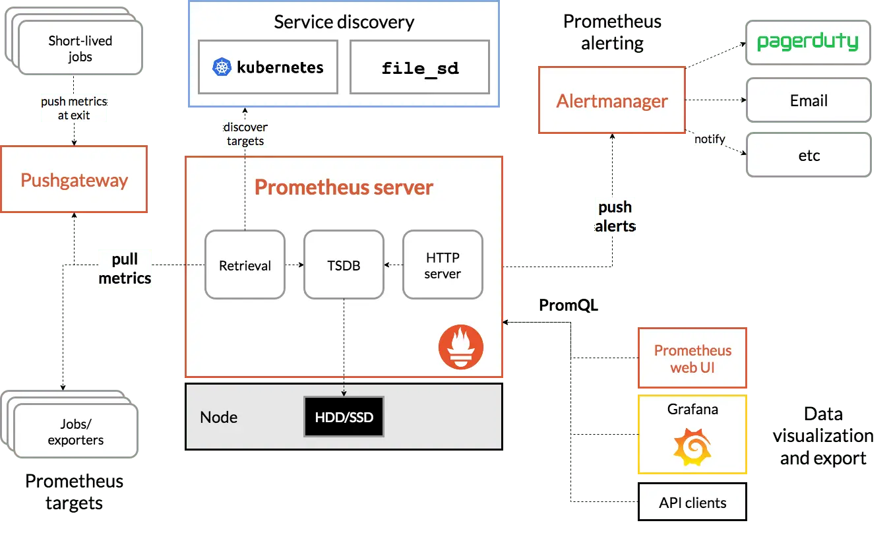

# Prometheus Lab

In this lab we would focus on installing Prometheus on a Kubernetes Cluster Directly. We can also install Prometheus on a standalone machine as well, however installing Prometheus on a Kubernetes cluster leads to many benefits, including ease of configuration management and as well as monitoring the same cluster on which it is deployed. This is not a production grade deployment and for that please refer to the [official Prometheus installation documentation](https://prometheus.io/docs/prometheus/latest/installation/) for a complete set of alternatives and best practices. The following diagram recaps the architecture as was discussed during the lecture:
 

## Installation

1. Open a shell in your host machine and navigate to the root directory of this repository from where you ssh to the master node previously. You should be in the `k8s-labs-mnemon` directory. From this directory issue the following commands to get the names of the booted nodes

```bash
PS C:\Users\shoun\OneDrive\Documents\kubernetes\k8s-labs-mnemon> vagrant status
Current machine states:

master                    running (virtualbox)
node01                    running (virtualbox)
node02                    running (virtualbox)

This environment represents multiple VMs. The VMs are all listed
above with their current state. For more information about a specific
VM, run `vagrant status NAME`.
PS C:\Users\shoun\OneDrive\Documents\kubernetes\k8s-labs-mnemon>
```

As we can see we have a 3 node cluster. 1 master and 2 worker nodes

Now from the the shell ssh to the master node:

```bash
PS C:\Users\shoun\OneDrive\Documents\kubernetes\k8s-labs-mnemon> vagrant ssh master
Welcome to Ubuntu 22.04.2 LTS (GNU/Linux 5.15.0-67-generic x86_64)

 * Documentation:  https://help.ubuntu.com
 * Management:     https://landscape.canonical.com
 * Support:        https://ubuntu.com/advantage

  System information as of Thu Oct 12 03:49:22 PM UTC 2023

  System load:  1.01416015625      Users logged in:        0
  Usage of /:   19.5% of 30.34GB   IPv4 address for eth0:  10.0.2.15
  Memory usage: 23%                IPv4 address for eth1:  192.168.56.20
  Swap usage:   0%                 IPv4 address for tunl0: 172.16.77.128
  Processes:    182

 * Introducing Expanded Security Maintenance for Applications.
   Receive updates to over 25,000 software packages with your
   Ubuntu Pro subscription. Free for personal use.

     https://ubuntu.com/pro


This system is built by the Bento project by Chef Software
More information can be found at https://github.com/chef/bento
Last login: Thu Oct 12 12:42:29 2023 from 10.0.2.2
vagrant@master-node:~$
```

2. Navigate to the folder `/vagrant/prometheus`

```bash
vagrant@master-node:~$ cd /vagrant/prometheus/
vagrant@master-node:/vagrant/prometheus$
```


3. Create a namespace called `monitoring` where we would be deploying Prometheus

```bash
vagrant@master-node:/vagrant/prometheus$ kubectl create namespace monitoring
namespace/monitoring created
vagrant@master-node:/vagrant/prometheus$
```

4. There are multiple files in this directory and we would be using some of them in this lab:

```bash
vagrant@master-node:/vagrant/prometheus$ ls -ltr
total 80
-rw-rw-r-- 1 vagrant vagrant   743 Oct  6 08:33 README.MD
-rw-rw-r-- 1 vagrant vagrant   315 Oct  6 08:33 prometheus-service.yaml
-rw-rw-r-- 1 vagrant vagrant  5709 Oct  6 08:33 prometheus-ingress.yaml
-rw-rw-r-- 1 vagrant vagrant   962 Oct  6 08:33 prometheus-deployment.yaml
-rw-rw-r-- 1 vagrant vagrant  5041 Oct  6 08:33 config-map.yaml
-rw-rw-r-- 1 vagrant vagrant   618 Oct  6 08:33 clusterRole.yaml
-rw-rw-r-- 1 vagrant vagrant 45826 Oct  6 08:33 1-prometheus-architecture-min.png
vagrant@master-node:/vagrant/prometheus$
```

5. First let's look at the ClusterRole, ClusterRoleBinding and ServiceAccount which would be used by Prometheus to interact with the API server and obtain certain information. Especially helps in Service Discovery

```bash
vagrant@master-node:/vagrant/prometheus$ cat clusterRole.yaml
apiVersion: rbac.authorization.k8s.io/v1
kind: ClusterRole
metadata:
  name: prometheus
rules:
- apiGroups: [""]
  resources:
  - nodes
  - nodes/proxy
  - services
  - endpoints
  - pods
  verbs: ["get", "list", "watch"]
- apiGroups:
  - extensions
  resources:
  - ingresses
  verbs: ["get", "list", "watch"]
- nonResourceURLs: ["/metrics"]
  verbs: ["get"]
---
apiVersion: rbac.authorization.k8s.io/v1
kind: ClusterRoleBinding
metadata:
  name: prometheus
roleRef:
  apiGroup: rbac.authorization.k8s.io
  kind: ClusterRole
  name: prometheus
subjects:
- kind: ServiceAccount
  name: default
  namespace: monitoring
vagrant@master-node:/vagrant/prometheus$
```
Note: In the role, given below, you can see that we have added get, list, and watch permissions to nodes, services endpoints, pods, and ingresses. The role binding is bound to the monitoring namespace. If you have any use case to retrieve metrics from any other object, you need to add that in this cluster role.

```bash
vagrant@master-node:/vagrant/prometheus$ kubectl create -f clusterRole.yaml
clusterrole.rbac.authorization.k8s.io/prometheus created
clusterrolebinding.rbac.authorization.k8s.io/prometheus created
vagrant@master-node:/vagrant/prometheus$
```

6. Create a ConfigMap to Externalize the Configuration
All configurations for Prometheus are part of `prometheus.yaml` file and all the alert rules for Alertmanager are configured in `prometheus.rules`.
    - `prometheus.yaml`: This is the main Prometheus configuration which holds all the scrape configs, service discovery details, storage locations, data retention configs, etc
    - `prometheus.rules`: This file contains all the Prometheus alerting rules
By externalizing Prometheus configs to a Kubernetes config map, you don’t have to build the Prometheus image whenever you need to add or remove a configuration. You need to update the config map and restart the Prometheus pods to apply the new configuration.

The config map with all the Prometheus scrape config and alerting rules gets mounted to the Prometheus container in /etc/prometheus location as prometheus.yaml and prometheus.rules files.

Please create the config-map from the `config-map.yaml` file in this directory

```bash
vagrant@master-node:/vagrant/prometheus$ kubectl create -f config-map.yaml
configmap/prometheus-server-conf created
vagrant@master-node:/vagrant/prometheus$
```

If you closely observe the file, this config map has two key value pairs, with keys as `prometheus.rules` and `prometheus.yaml`. The values for both these keys are yaml entries. these will be mounted as two files from the config map on the prometheus server when we use the ConfigMap as a VolumeMount there

**Note**: In Prometheus terms, the config for collecting metrics from a collection of endpoints is called a job.

The `prometheus.yaml` contains all the configurations to discover pods and services running in the Kubernetes cluster dynamically. We have the following [scrape jobs](https://prometheus.io/docs/concepts/jobs_instances/) in our Prometheus scrape configuration.

    - `kubernetes-apiservers`: It gets all the metrics from the API servers.
    - `kubernetes-nodes`: It collects all the kubernetes node metrics.
    - `kubernetes-pods`: All the pod metrics get discovered if the pod metadata is annotated with `prometheus.io/scrape` and `prometheus.io/port` annotations.
    - `kubernetes-cadvisor`: Collects all cAdvisor metrics.
    - `kubernetes-service-endpoints`: All the Service endpoints are scrapped if the service metadata is annotated with `prometheus.io/scrape` and `prometheus.io/port` annotations. It can be used for black-box monitoring.

    `prometheus.rules` contains all the alert rules for sending alerts to the Alertmanager.

7. Finally deploy the Prometheus Server using the `prometheus-deployment.yaml` file. Observer the file about how do we specify startup configs and also mount the data in the configmaps to the Prometheus Server

```bash
vagrant@master-node:/vagrant/prometheus$ kubectl create -f prometheus-deployment.yaml
deployment.apps/prometheus-deployment created
vagrant@master-node:/vagrant/prometheus$
```

and check the status of the pods such that they reach the running state:

```bash
vagrant@master-node:/vagrant/prometheus$ kubectl get deployments -n monitoring
NAME                    READY   UP-TO-DATE   AVAILABLE   AGE
prometheus-deployment   1/1     1            1           86s
vagrant@master-node:/vagrant/prometheus$ kubectl get po -n monitoring
NAME                                     READY   STATUS    RESTARTS   AGE
prometheus-deployment-57898c796b-xxj84   1/1     Running   0          94s
vagrant@master-node:/vagrant/prometheus$
```

8. Create the Prometheus Service from the `prometheus-service.yaml` file and then login to the Prometheus UI from your hosts's browser:

```bash
vagrant@master-node:/vagrant/prometheus$ kubectl create -f prometheus-service.yaml
service/prometheus-service created
vagrant@master-node:/vagrant/prometheus$ kubectl get svc -n monitoring
NAME                 TYPE       CLUSTER-IP     EXTERNAL-IP   PORT(S)          AGE
prometheus-service   NodePort   172.17.2.223   <none>        8080:30000/TCP   10s
vagrant@master-node:/vagrant/prometheus$
```

Hence the NodePort is 30000. Login to the Prometheus UI from the host by accessing `http://192.168.56.21:30000` where `192.168.56.21` is the IP of the first Worker Node which you can get by running the following command:

```bash
vagrant@master-node:/vagrant/prometheus$ kubectl get nodes -o wide
NAME            STATUS   ROLES           AGE    VERSION   INTERNAL-IP     EXTERNAL-IP   OS-IMAGE             KERNEL-VERSION      CONTAINER-RUNTIME
master-node     Ready    control-plane   132m   v1.27.1   192.168.56.20   <none>        Ubuntu 22.04.2 LTS   5.15.0-67-generic   cri-o://1.27.1
worker-node01   Ready    worker          128m   v1.27.1   192.168.56.21   <none>        Ubuntu 22.04.2 LTS   5.15.0-67-generic   cri-o://1.27.1
vagrant@master-node:/vagrant/prometheus$
```

This should show the page as follows:


Now if you navigate to `status->targets` you should be able to see all the targets that Prometheus automatically discovered through Service Discovery


We can even view some of the metrics over time. Just go back to the Home Page by clicking the Prometheus Icon on the top left. Then on the search panel, write `container_cpu_usage_seconds_total` and click on Execute. Similar to this metric you can see multiple other metrices scraped by Prometheus blickin the small `world` icon to the left of the Execute button. Refer to the picture below:


If you scroll down on the graph, you would also see a sample of all the raw metrics that have been used to plot the graph. These are metrics that are scraped and stored in prometheus as was discussed during the lecture.


