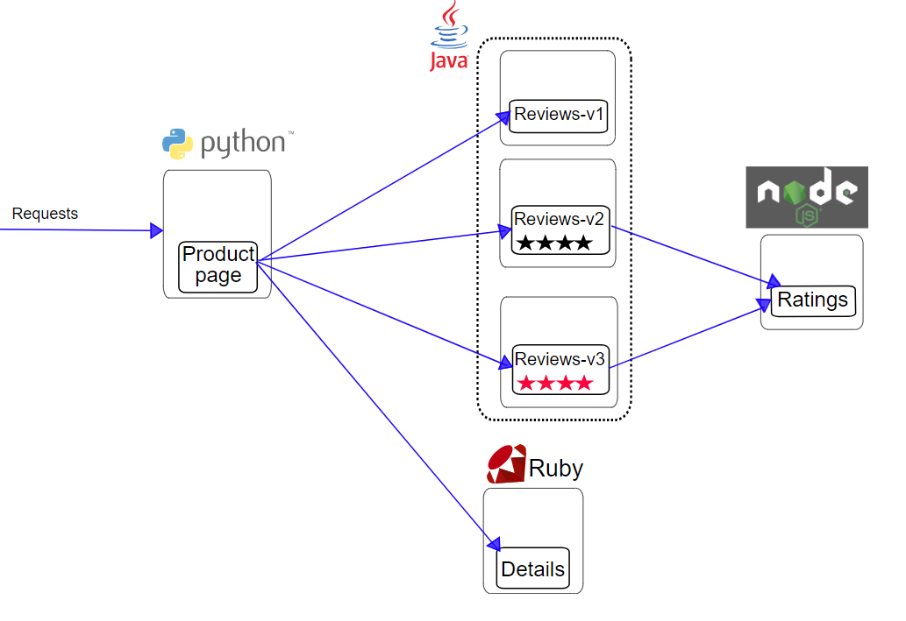
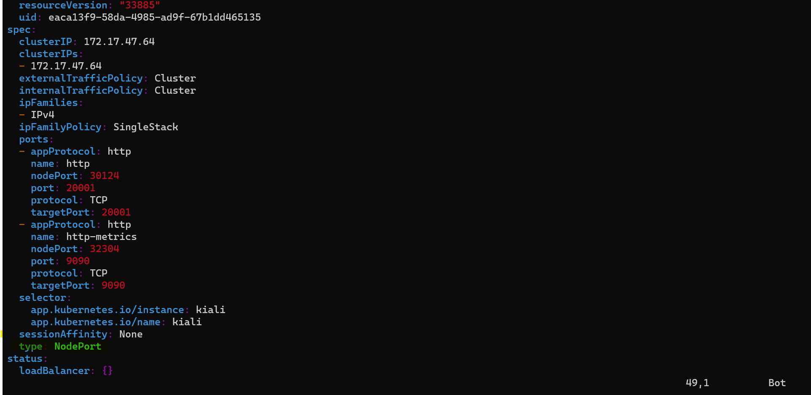
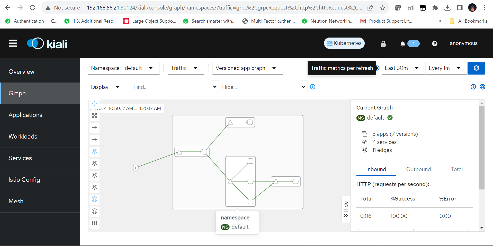

# Service Mesh with Istio

Open a shell in your host machine and navigate to the root directory of this repository from where you ssh to the master node previously. You should be in the `k8s-labs-mnemon` directory. From this directory issue the following commands to get the names of the booted nodes

```bash
PS C:\Users\shoun\OneDrive\Documents\kubernetes\k8s-labs-mnemon> vagrant status
Current machine states:

master                    running (virtualbox)
node01                    running (virtualbox)
node02                    running (virtualbox)

This environment represents multiple VMs. The VMs are all listed
above with their current state. For more information about a specific
VM, run `vagrant status NAME`.
PS C:\Users\shoun\OneDrive\Documents\kubernetes\k8s-labs-mnemon>
```

As we can see we have a 3 node cluster. 1 master and 2 worker nodes

Now from the the shell ssh to the master node:

```bash
PS C:\Users\shoun\OneDrive\Documents\kubernetes\k8s-labs-mnemon> vagrant ssh master
Welcome to Ubuntu 22.04.2 LTS (GNU/Linux 5.15.0-67-generic x86_64)

 * Documentation:  https://help.ubuntu.com
 * Management:     https://landscape.canonical.com
 * Support:        https://ubuntu.com/advantage

  System information as of Thu Oct 12 03:49:22 PM UTC 2023

  System load:  1.01416015625      Users logged in:        0
  Usage of /:   19.5% of 30.34GB   IPv4 address for eth0:  10.0.2.15
  Memory usage: 23%                IPv4 address for eth1:  192.168.56.20
  Swap usage:   0%                 IPv4 address for tunl0: 172.16.77.128
  Processes:    182

 * Introducing Expanded Security Maintenance for Applications.
   Receive updates to over 25,000 software packages with your
   Ubuntu Pro subscription. Free for personal use.

     https://ubuntu.com/pro


This system is built by the Bento project by Chef Software
More information can be found at https://github.com/chef/bento
Last login: Thu Oct 12 12:42:29 2023 from 10.0.2.2
vagrant@master-node:~$
```

## Download Istio
1. Go to the [Istio release](https://github.com/istio/istio/releases/tag/1.19.0) page to download the installation file for your OS, or download and extract the latest release automatically (Linux or macOS). We would be using the version 1.19.0 for this lab purposes. In this lab, since we would be using Linux and a specific version, we would be directly passing in these infomration in the curl command directly as under:
```bash
vagrant@master-node:~$ curl -L https://istio.io/downloadIstio | ISTIO_VERSION=1.19.0 TARGET_ARCH=x86_64 sh -
  % Total    % Received % Xferd  Average Speed   Time    Time     Time  Current
                                 Dload  Upload   Total   Spent    Left  Speed
100   102    0   102    0     0    292      0 --:--:-- --:--:-- --:--:--   293
100  4899  100  4899    0     0   4671      0  0:00:01  0:00:01 --:--:--  4671

Downloading istio-1.19.0 from https://github.com/istio/istio/releases/download/1.19.0/istio-1.19.0-linux-amd64.tar.gz ...

Istio 1.19.0 Download Complete!

Istio has been successfully downloaded into the istio-1.19.0 folder on your system.

Next Steps:
See https://istio.io/latest/docs/setup/install/ to add Istio to your Kubernetes cluster.

To configure the istioctl client tool for your workstation,
add the /home/vagrant/istio-1.19.0/bin directory to your environment path variable with:
         export PATH="$PATH:/home/vagrant/istio-1.19.0/bin"

Begin the Istio pre-installation check by running:
         istioctl x precheck

Need more information? Visit https://istio.io/latest/docs/setup/install/
vagrant@master-node:~$
```
2. Move to the Istio package directory:
```bash
vagrant@master-node:~$ cd istiod-1.19.0
vagrant@master-node:~/istio-1.19.0$
```

The installation directory contains:
    - Sample applications in `samples/`
    - The `istioctl` client binary in the `bin/` directory
3. Add the `istioctl` client to your path (Linux or MacOS)
```bash
vagrant@master-node:~/istio-1.19.0$export PATH=$PWD/bin:$PATH
```


## Install Istio
1. Istio comes with a lot of [configuration profiles](https://istio.io/latest/docs/setup/additional-setup/config-profiles/) which let you configure Istio with a lot of defaults for a particular use case. In this lab and subsequent examples, we would be using the `demo` profile which has a lot of configuration settings apt for getting started. Beyond the ones provided by Istio, platform vendors like AWS, Openshift etc. provide their own [platform specific configuration profiles](https://istio.io/latest/docs/setup/platform-setup/) which are ideal for running istio on these platforms 
```bash
vagrant@master-node:~/istio-1.19.0$ istioctl install --set profile=demo -y
✔ Istio core installed
✔ Istiod installed
✔ Egress gateways installed
✔ Ingress gateways installed
✔ Installation complete
Made this installation the default for injection and validation.
vagrant@master-node:~/istio-1.19.0$
```
2. Istio requires namespaces to be labeled where Istio can automatically inject sidecars. In this tutorial we will enable automatic envoy injection in the the default namespace

```bash
vagrant@master-node:~/istio-1.19.0$ kubectl label namespace default istio-injection=enabled
namespace/default labeled
vagrant@master-node:~/istio-1.19.0$
```

## Checking external IP and Ports for Istio Applications
Istio applications are deployed within a mesh and Istio takes care of the routing between various applications. However, Istio applications can also be exposed outside the cluster using the Istio Ingress Gateway component which is deployed during the istio installation. The following points show how to get the details of the Istio Ingress Gateway. Please note that this is not the same ingress gateway based upon nginx that we have discussed previously

1. Firstly for typing less, we create two environment variables holding our `istio-ingress-gateway` and the `istio-namespace` name

```bash
vagrant@master-node:~$ export INGRESS_NAME=istio-ingressgateway
vagrant@master-node:~$ echo $INGRESS_NAME
istio-ingressgateway
vagrant@master-node:~$ export INGRESS_NS=istio-system
vagrant@master-node:~$ echo $INGRESS_NS
istio-system
vagrant@master-node:~$
```
2. Next we create some more environment variables which points to the various NodePorts for each of the Istio Ingress Gateway service. These are ports for ingressing traffic into Istio Applications on TCP, HTTP and HTTPS

```bash
vagrant@master-node:~$ export INGRESS_PORT=$(kubectl -n "${INGRESS_NS}" get service "${INGRESS_NAME}" -o jsonpath='{.spec.ports[?(@.name=="http2")].nodePort}')
vagrant@master-node:~$ export SECURE_INGRESS_PORT=$(kubectl -n "${INGRESS_NS}" get service "${INGRESS_NAME}" -o jsonpath='{.spec.ports[?(@.name=="https")].nodePort}')
vagrant@master-node:~$ export TCP_INGRESS_PORT=$(kubectl -n "${INGRESS_NS}" get service "${INGRESS_NAME}" -o jsonpath='{.spec.ports[?(@.name=="tcp")].nodePort}')
vagrant@master-node:~$ echo $INGRESS_PORT
31976
vagrant@master-node:~$ echo $SECURE_INGRESS_PORT
31109
vagrant@master-node:~$ echo $TCP_INGRESS_PORT
31928
vagrant@master-node:~$
```
3. Also set the Ingress Host environment variable to the IP of the first worker node. Technically this could be the IP of any node in the cluster, but for uniformity purpose we would take the IP of the first worker node for this lab

```bash
vagrant@master-node:~$ kubectl get nodes -o wide
NAME            STATUS   ROLES           AGE   VERSION   INTERNAL-IP     EXTERNAL-IP   OS-IMAGE             KERNEL-VERSION      CONTAINER-RUNTIME
master-node     Ready    control-plane   94m   v1.27.1   192.168.56.20   <none>        Ubuntu 22.04.2 LTS   5.15.0-67-generic   cri-o://1.27.1
worker-node01   Ready    worker          89m   v1.27.1   192.168.56.21   <none>        Ubuntu 22.04.2 LTS   5.15.0-67-generic   cri-o://1.27.1
vagrant@master-node:~$ export INGRESS_HOST='192.168.56.21'
vagrant@master-node:~$ echo $INGRESS_HOST
192.168.56.21
```

4. Finally we create the GATEWAY_URL variable which would be the first point of contact for external applications or users hitting applications deployed inside the Istio Service Mesh
```bash
vagrant@master-node:~$ export GATEWAY_URL=$INGRESS_HOST:$INGRESS_PORT
vagrant@master-node:~$ echo $GATEWAY_URL
192.168.56.21:31976
```

## Deploy the Sample [BookInfo Application](https://istio.io/latest/docs/examples/bookinfo/)



1. Make sure you are into the istio-1.19.0 folder:
```bash
vagrant@master-node:~/istio-1.19.0$ pwd
/home/vagrant/istio-1.19.0
vagrant@master-node:~/istio-1.19.0$
```

2. Deploy the BookInfo application located in the samples directory as under:
```bash
vagrant@master-node:~/istio-1.19.0$ kubectl apply -f samples/bookinfo/platform/kube/bookinfo.yaml
service/details created
serviceaccount/bookinfo-details created
deployment.apps/details-v1 created
service/ratings created
serviceaccount/bookinfo-ratings created
deployment.apps/ratings-v1 created
service/reviews created
serviceaccount/bookinfo-reviews created
deployment.apps/reviews-v1 created
deployment.apps/reviews-v2 created
deployment.apps/reviews-v3 created
service/productpage created
serviceaccount/bookinfo-productpage created
deployment.apps/productpage-v1 created
vagrant@master-node:~/istio-1.19.0$
```

3. The application will start. As each pod becomes ready, the Istio sidecar will be deployed along with it.

```bash
vagrant@master-node:~/istio-1.19.0$ kubectl get services
NAME          TYPE        CLUSTER-IP      EXTERNAL-IP   PORT(S)    AGE
details       ClusterIP   172.17.62.73    <none>        9080/TCP   70s
kubernetes    ClusterIP   172.17.0.1      <none>        443/TCP    14h
productpage   ClusterIP   172.17.24.196   <none>        9080/TCP   70s
ratings       ClusterIP   172.17.61.1     <none>        9080/TCP   70s
reviews       ClusterIP   172.17.15.92    <none>        9080/TCP   70s
vagrant@master-node:~/istio-1.19.0$
```

and

```bash
vagrant@master-node:~/istio-1.19.0$ kubectl get pods
NAME                             READY   STATUS    RESTARTS   AGE
details-v1-5f4d584748-v4n98      2/2     Running   0          2m35s
productpage-v1-564d4686f-qnjdf   2/2     Running   0          2m35s
ratings-v1-686ccfb5d8-fhql9      2/2     Running   0          2m35s
reviews-v1-86896b7648-dwkpj      2/2     Running   0          2m35s
reviews-v2-b7dcd98fb-wd7hv       2/2     Running   0          2m35s
reviews-v3-5c5cc7b6d-x4wck       2/2     Running   0          2m35s
vagrant@master-node:~/istio-1.19.0$
```

3. Verify everything is working correctly up to this point. Run this command to see if the app is running inside the cluster and serving HTML pages by checking for the page title in the response:

```bash
vagrant@master-node:~/istio-1.19.0$ kubectl exec "$(kubectl get pod -l app=ratings -o jsonpath='{.items[0].metadata.name}')" -c ratings -- curl -sS productpage:9080/productpage | grep -o "<title>.*</title>"
<title>Simple Bookstore App</title>
vagrant@master-node:~/istio-1.19.0$
```

## Open the application to Outside traffic

The Bookinfo application is deployed but not accessible from the outside. To make it accessible, you need to create an Istio Ingress Gateway, which maps a path to a route at the edge of your mesh.

1. Make sure you are into the istio-1.19.0 folder:
```bash
vagrant@master-node:~/istio-1.19.0$ pwd
/home/vagrant/istio-1.19.0
vagrant@master-node:~/istio-1.19.0$
```

2. Associate this application with the Istio gateway:
```bash
vagrant@master-node:~/istio-1.19.0$ kubectl apply -f samples/bookinfo/networking/bookinfo-gateway.yaml
gateway.networking.istio.io/bookinfo-gateway created
virtualservice.networking.istio.io/bookinfo created
vagrant@master-node:~/istio-1.19.0$
```

3. Ensure that there are no issues with the configuration:
```bash
vagrant@master-node:~/istio-1.19.0$ istioctl analyze

✔ No validation issues found when analyzing namespace: default.
vagrant@master-node:~/istio-1.19.0$
```

## Verify External access

1. Get the FQDN of the application by issuing the following command:

```bash
vagrant@master-node:~/istio-1.19.0$ echo "http://$GATEWAY_URL/productpage"
http://192.168.56.21:31976/productpage
vagrant@master-node:~/istio-1.19.0$
```

2. Now paste the URL returned as output which is [http://192.168.56.21:31976/productpage](http://192.168.56.21:31976/productpage) into your browser. You should be able to access the following page:


## View the Dashboard:
Istio integrates with [several](https://istio.io/latest/docs/ops/integrations) different telemetry applications. These can help you gain an understanding of the structure of your service mesh, display the topology of the mesh, and analyze the health of your mesh.

Use the following instructions to deploy the [Kiali](https://istio.io/latest/docs/ops/integrations/kiali/) dashboard, along with [Prometheus](https://istio.io/latest/docs/ops/integrations/prometheus/), [Grafana](https://istio.io/latest/docs/ops/integrations/grafana), and [Jaeger](https://istio.io/latest/docs/ops/integrations/jaeger/).

1. Make sure you are into the istio-1.19.0 folder:
```bash
vagrant@master-node:~/istio-1.19.0$ pwd
/home/vagrant/istio-1.19.0
vagrant@master-node:~/istio-1.19.0$
```

2. Install [Kiali and the other addons](https://github.com/istio/istio/tree/release-1.19/samples/addons) and wait for them to be deployed.

```bash
vagrant@master-node:~/istio-1.19.0$ kubectl apply -f samples/addons
serviceaccount/grafana created
configmap/grafana created
service/grafana created
deployment.apps/grafana created
configmap/istio-grafana-dashboards created
configmap/istio-services-grafana-dashboards created
deployment.apps/jaeger created
service/tracing created
service/zipkin created
service/jaeger-collector created
serviceaccount/kiali created
configmap/kiali created
clusterrole.rbac.authorization.k8s.io/kiali-viewer created
clusterrole.rbac.authorization.k8s.io/kiali created
clusterrolebinding.rbac.authorization.k8s.io/kiali created
role.rbac.authorization.k8s.io/kiali-controlplane created
rolebinding.rbac.authorization.k8s.io/kiali-controlplane created
service/kiali created
deployment.apps/kiali created
serviceaccount/loki created
configmap/loki created
configmap/loki-runtime created
service/loki-memberlist created
service/loki-headless created
service/loki created
statefulset.apps/loki created
serviceaccount/prometheus created
configmap/prometheus created
clusterrole.rbac.authorization.k8s.io/prometheus created
clusterrolebinding.rbac.authorization.k8s.io/prometheus created
service/prometheus created
deployment.apps/prometheus created
vagrant@master-node:~/istio-1.19.0$
```
2. Check the status of the Kiali Dashboard service:

```bash
vagrant@master-node:~/istio-1.19.0$ kubectl rollout status deployment/kiali -n istio-system
deployment "kiali" successfully rolled out
vagrant@master-node:~/istio-1.19.0$
```

3. To see some trace data on the service mesh, we need to access the application a few times. The following script does that and generates some test traffic which can be later viewed on the Kiali Dashboard

```bash
vagrant@master-node:~/istio-1.19.0$ for i in $(seq 1 100); do curl -s -o /dev/null "http://$GATEWAY_URL/productpage"; done
vagrant@master-node:~/istio-1.19.0$
```

4. We have to change the Kiali Service to type NodePort so that we are able to access the webpage from our machine's browser. In order to do that, first edit the Kiali Service by issuing the following command
```bash
vagrant@master-node:~/istio-1.19.0$ kubectl edit svc kiali -n istio-system
```
This will Open the Following Page. Edit the Service Type highlighted in green in the diagram. This would have ClusterIP which you need to change to NodePort and save and exit by typing `[Esc]` Followed by `wq!`


5. Check the NodePort for the Kiali Service for port 20001
```bash
vagrant@master-node:~/istio-1.19.0$ kubectl get svc -n istio-system
NAME                   TYPE           CLUSTER-IP      EXTERNAL-IP   PORT(S)
            AGE
grafana                ClusterIP      172.17.42.11    <none>        3000/TCP
            25m
istio-egressgateway    ClusterIP      172.17.10.129   <none>        80/TCP,443/TCP
            14h
istio-ingressgateway   LoadBalancer   172.17.53.49    <pending>     15021:32561/TCP,80:31976/TCP,443:31109/TCP,31400:31928/TCP,15443:31497/TCP   14h
istiod                 ClusterIP      172.17.62.28    <none>        15010/TCP,15012/TCP,443/TCP,15014/TCP
            14h
jaeger-collector       ClusterIP      172.17.37.207   <none>        14268/TCP,14250/TCP,9411/TCP,4317/TCP,4318/TCP
            25m
kiali                  NodePort       172.17.47.64    <none>        20001:30124/TCP,9090:32304/TCP
            25m
loki-headless          ClusterIP      None            <none>        3100/TCP
            25m
prometheus             ClusterIP      172.17.39.43    <none>        9090/TCP
            25m
tracing                ClusterIP      172.17.23.52    <none>        80/TCP,16685/TCP
            25m
zipkin                 ClusterIP      172.17.3.140    <none>        9411/TCP
            25m
vagrant@master-node:~/istio-1.19.0$
```
In this case the NodePort corresponding to the Kiali Service at 20001 is 30124

6. Issue the following command to get the FQDN of the service so that it can be accessed from the host machine's browser.
```bash
vagrant@master-node:~/istio-1.19.0$ export KIALI_PORT=30124
vagrant@master-node:~/istio-1.19.0$ echo $KIALI_PORT
30124
vagrant@master-node:~/istio-1.19.0$ echo "http://$INGRESS_HOST:$KIALI_PORT/kiali"
http://192.168.56.21:30124/kiali
vagrant@master-node:~/istio-1.19.0$
```
Notice the Ports that have been put based on the NodePort obtained in the previous step

7. Acess the kiali webpage. Then on the Left Hand Menu -> Select Graph. On this page, select Namespace as default on the top left and time range as 30m on the top right as shown below:


8. Re-run the following script to generate more traffic if it was not visible:

```bash
vagrant@master-node:~/istio-1.19.0$ for i in $(seq 1 100); do curl -s -o /dev/null "http://$GATEWAY_URL/productpage"; done
vagrant@master-node:~/istio-1.19.0$
```

9. Feel free to play around with the options.


## Request Routing

This task shows you how to route requests dynamically to multiple versions of a microservice.

The Istio Bookinfo sample consists of four separate microservices, each with multiple versions. Three different versions of one of the microservices, reviews, have been deployed and are running concurrently. To illustrate the problem this causes, access the Bookinfo app’s /productpage in a browser and refresh several times. The URL is http://$GATEWAY_URL/productpage, where $GATEWAY_URL is the External IP address of the ingress, as explained in the Bookinfo doc.

You’ll notice that sometimes the book review output contains star ratings and other times it does not. This is because without an explicit default service version to route to, Istio routes requests to all available versions in a round robin fashion.

The initial goal of this task is to apply rules that route all traffic to v1 (version 1) of the microservices. Later, you will apply a rule to route traffic based on the value of an HTTP request header.

### Route to Version 1

To route to one version only, you configure route rules that send traffic to default versions for the microservices.

1. Make sure you are into the istio-1.19.0 folder:
```bash
vagrant@master-node:~/istio-1.19.0$ pwd
/home/vagrant/istio-1.19.0
vagrant@master-node:~/istio-1.19.0$
```

2. Run the following command to create the route rules:
Istio uses virtual services to define route rules. Run the following command to apply virtual services that will route all traffic to v1 of each microservice:

```bash
vagrant@master-node:~/istio-1.19.0$ kubectl apply -f samples/bookinfo/networking/virtual-service-all-v1.yaml
virtualservice.networking.istio.io/productpage created
virtualservice.networking.istio.io/reviews created
virtualservice.networking.istio.io/ratings created
virtualservice.networking.istio.io/details created
vagrant@master-node:~/istio-1.19.0$
```
Because configuration propagation is eventually consistent, wait a few seconds for the virtual services to take effect.

3. Run the following commands to create the destinationrules used by the above virtualservices.

```bash
vagrant@master-node:~/istio-1.19.0$ kubectl apply -f samples/bookinfo/networking/destination-rule-all.yaml
destinationrule.networking.istio.io/productpage created
destinationrule.networking.istio.io/reviews created
destinationrule.networking.istio.io/ratings created
destinationrule.networking.istio.io/details created
vagrant@master-node:~/istio-1.19.0$
```

3. Display the defined rules with either of the following command:

```bash
vagrant@master-node:~/istio-1.19.0$  kubectl get virtualservices -o yaml
apiVersion: v1
items:
- apiVersion: networking.istio.io/v1beta1
  kind: VirtualService
  metadata:
    annotations:
      kubectl.kubernetes.io/last-applied-configuration: |
        {"apiVersion":"networking.istio.io/v1alpha3","kind":"VirtualService","metadata":{"annotations":{},"name":"bookinfo","namespace":"default"},"spec":{"gateways":["bookinfo-gateway"],"hosts":["*"],"http":[{"match":[{"uri":{"exact":"/productpage"}},{"uri":{"prefix":"/static"}},{"uri":{"exact":"/login"}},{"uri":{"exact":"/logout"}},{"uri":{"prefix":"/api/v1/products"}}],"route":[{"destination":{"host":"productpage","port":{"number":9080}}}]}]}}
    creationTimestamp: "2023-10-04T05:02:28Z"
    generation: 1
    name: bookinfo
    namespace: default
    resourceVersion: "30455"
    uid: ec85dc4c-9670-4c03-b1dd-647079cf06bf
  spec:
    gateways:
    - bookinfo-gateway
    hosts:
    - '*'
    http:
    - match:
      - uri:
          exact: /productpage
      - uri:
          prefix: /static
      - uri:
          exact: /login
      - uri:
          exact: /logout
      - uri:
          prefix: /api/v1/products
      route:
      - destination:
          host: productpage
          port:
            number: 9080
- apiVersion: networking.istio.io/v1beta1
  kind: VirtualService
  metadata:
    annotations:
      kubectl.kubernetes.io/last-applied-configuration: |
        {"apiVersion":"networking.istio.io/v1alpha3","kind":"VirtualService","metadata":{"annotations":{},"name":"details","namespace":"default"},"spec":{"hosts":["details"],"http":[{"route":[{"destination":{"host":"details","subset":"v1"}}]}]}}
    creationTimestamp: "2023-10-05T05:31:01Z"
    generation: 1
    name: details
    namespace: default
    resourceVersion: "62957"
    uid: 912d1667-91d6-412c-a526-c23620f76bcc
  spec:
    hosts:
    - details
    http:
    - route:
      - destination:
          host: details
          subset: v1
- apiVersion: networking.istio.io/v1beta1
  kind: VirtualService
  metadata:
    annotations:
      kubectl.kubernetes.io/last-applied-configuration: |
        {"apiVersion":"networking.istio.io/v1alpha3","kind":"VirtualService","metadata":{"annotations":{},"name":"productpage","namespace":"default"},"spec":{"hosts":["productpage"],"http":[{"route":[{"destination":{"host":"productpage","subset":"v1"}}]}]}}
    creationTimestamp: "2023-10-05T05:31:01Z"
    generation: 1
    name: productpage
    namespace: default
    resourceVersion: "62954"
    uid: 6038ffc7-4aec-4d5d-a4c2-125d5e8ad8b3
  spec:
    hosts:
    - productpage
    http:
    - route:
      - destination:
          host: productpage
          subset: v1
- apiVersion: networking.istio.io/v1beta1
  kind: VirtualService
  metadata:
    annotations:
      kubectl.kubernetes.io/last-applied-configuration: |
        {"apiVersion":"networking.istio.io/v1alpha3","kind":"VirtualService","metadata":{"annotations":{},"name":"ratings","namespace":"default"},"spec":{"hosts":["ratings"],"http":[{"route":[{"destination":{"host":"ratings","subset":"v1"}}]}]}}
    creationTimestamp: "2023-10-05T05:31:01Z"
    generation: 1
    name: ratings
    namespace: default
    resourceVersion: "62956"
    uid: 3ae37727-91ff-42af-ac07-7b66cfad1c06
  spec:
    hosts:
    - ratings
    http:
    - route:
      - destination:
          host: ratings
          subset: v1
- apiVersion: networking.istio.io/v1beta1
  kind: VirtualService
  metadata:
    annotations:
      kubectl.kubernetes.io/last-applied-configuration: |
        {"apiVersion":"networking.istio.io/v1alpha3","kind":"VirtualService","metadata":{"annotations":{},"name":"reviews","namespace":"default"},"spec":{"hosts":["reviews"],"http":[{"route":[{"destination":{"host":"reviews","subset":"v1"}}]}]}}
    creationTimestamp: "2023-10-05T05:31:01Z"
    generation: 1
    name: reviews
    namespace: default
    resourceVersion: "62955"
    uid: f84a974d-8ca4-4a34-9646-0ce1cb049455
  spec:
    hosts:
    - reviews
    http:
    - route:
      - destination:
          host: reviews
          subset: v1
kind: List
metadata:
  resourceVersion: ""
vagrant@master-node:~/istio-1.19.0$
```

and

```bash
vagrant@master-node:~/istio-1.19.0$ kubectl get destinationrules
NAME          HOST          AGE
details       details       14s
productpage   productpage   14s
ratings       ratings       14s
reviews       reviews       14s
vagrant@master-node:~/istio-1.19.0$
```
You have configured Istio to route to the v1 version of the Bookinfo microservices, most importantly the reviews service version 1.

### Test the new Routing Configuration

You can easily test the new configuration by once again refreshing the /productpage of the Bookinfo app in your browser. Notice that the reviews part of the page displays with no rating stars, no matter how many times you refresh. This is because you configured Istio to route all traffic for the reviews service to the version reviews:v1 and this version of the service does not access the star ratings service.


### Route Based on user identity

Next, you will change the route configuration so that all traffic from a specific user is routed to a specific service version. In this case, all traffic from a user named Jason will be routed to the service reviews:v2.

This example is enabled by the fact that the productpage service adds a custom end-user header to all outbound HTTP requests to the reviews service.

Istio also supports routing based on strongly authenticated JWT on ingress gateway, refer to the [JWT claim based routing](https://istio.io/latest/docs/tasks/security/authentication/jwt-route) for more details.

Remember, reviews:v2 is the version that includes the star ratings feature.

1. Run the following command to enable user-based routing:

```bash
vagrant@master-node:~/istio-1.19.0$ kubectl apply -f samples/bookinfo/networking/virtual-service-reviews-test-v2.yaml
virtualservice.networking.istio.io/reviews configured
vagrant@master-node:~/istio-1.19.0$
```

2. On the `/productpage` of the Bookinfo app, log in as user jason.

Refresh the browser. What do you see? The star ratings appear next to each review. Note: Just enter the username as json and it would log you in

3. Log in as another user (pick any name you wish).

Refresh the browser. Now the stars are gone. This is because traffic is routed to reviews:v1 for all users except Jason.

### Understanding What Happened

In this task, you used Istio to send 100% of the traffic to the v1 version of each of the Bookinfo services. You then set a rule to selectively send traffic to version v2 of the reviews service based on a custom end-user header added to the request by the productpage service.

Note that Kubernetes services, like the Bookinfo ones used in this task, must adhere to certain restrictions to take advantage of Istio’s L7 routing features. Refer to the [Requirements for Pods and Services](https://istio.io/latest/docs/ops/deployment/requirements/) for details.

