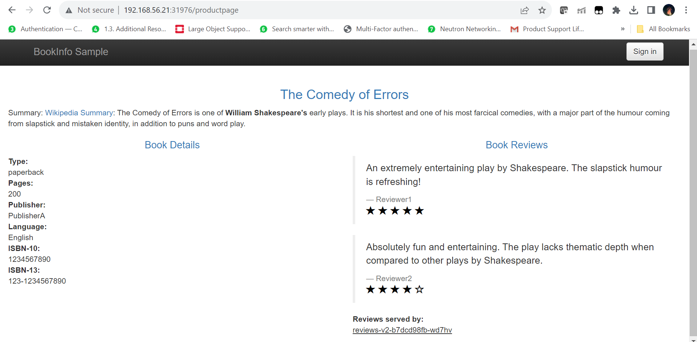

# Service Mesh with Istio
## Download Istio
1. Go to the [Istio release](https://github.com/istio/istio/releases/tag/1.19.0) page to download the installation file for your OS, or download and extract the latest release automatically (Linux or macOS). We would be using the version 1.19.0 for this lab purposes. In this lab, since we would be using Linux and a specific version, we would be directly passing in these infomration in the curl command directly as under:
```bash
vagrant@master-node:~$ curl -L https://istio.io/downloadIstio | ISTIO_VERSION=1.19.0 TARGET_ARCH=x86_64 sh -
  % Total    % Received % Xferd  Average Speed   Time    Time     Time  Current
                                 Dload  Upload   Total   Spent    Left  Speed
100   102    0   102    0     0    292      0 --:--:-- --:--:-- --:--:--   293
100  4899  100  4899    0     0   4671      0  0:00:01  0:00:01 --:--:--  4671

Downloading istio-1.19.0 from https://github.com/istio/istio/releases/download/1.19.0/istio-1.19.0-linux-amd64.tar.gz ...

Istio 1.19.0 Download Complete!

Istio has been successfully downloaded into the istio-1.19.0 folder on your system.

Next Steps:
See https://istio.io/latest/docs/setup/install/ to add Istio to your Kubernetes cluster.

To configure the istioctl client tool for your workstation,
add the /home/vagrant/istio-1.19.0/bin directory to your environment path variable with:
         export PATH="$PATH:/home/vagrant/istio-1.19.0/bin"

Begin the Istio pre-installation check by running:
         istioctl x precheck

Need more information? Visit https://istio.io/latest/docs/setup/install/
vagrant@master-node:~$
```
2. Move to the Istio package directory:
```bash
vagrant@master-node:~$ cd istiod-1.19.0
vagrant@master-node:~/istio-1.19.0$
```

The installation directory contains:
    - Sample applications in `samples/`
    - The `istioctl` client binary in the `bin/` directory
3. Add the `istioctl` client to your path (Linux or MacOS)
```bash
vagrant@master-node:~/istio-1.19.0$export PATH=$PWD/bin:$PATH
```


## Install Istio
1. Istio comes with a lot of [configuration profiles](https://istio.io/latest/docs/setup/additional-setup/config-profiles/) which let you configure Istio with a lot of defaults for a particular use case. In this lab and subsequent examples, we would be using the `demo` profile which has a lot of configuration settings apt for getting started. Beyond the ones provided by Istio, platform vendors like AWS, Openshift etc. provide their own [platform specific configuration profiles](https://istio.io/latest/docs/setup/platform-setup/) which are ideal for running istio on these platforms 
```bash
vagrant@master-node:~/istio-1.19.0$ istioctl install --set profile=demo -y
✔ Istio core installed
✔ Istiod installed
✔ Egress gateways installed
✔ Ingress gateways installed
✔ Installation complete
Made this installation the default for injection and validation.
vagrant@master-node:~/istio-1.19.0$
```
2. Istio requires namespaces to be labeled where Istio can automatically inject sidecars. In this tutorial we will enable automatic envoy injection in the the default namespace

```bash
vagrant@master-node:~/istio-1.19.0$ kubectl label namespace default istio-injection=enabled
namespace/default labeled
vagrant@master-node:~/istio-1.19.0$
```

## Checking external IP and Ports for Istio Applications
Istio applications are deployed within a mesh and Istio takes care of the routing between various applications. However, Istio applications can also be exposed outside the cluster using the Istio Ingress Gateway component which is deployed during the istio installation. The following points show how to get the details of the Istio Ingress Gateway. Please note that this is not the same ingress gateway based upon nginx that we have discussed previously

1. Firstly for typing less, we create two environment variables holding our `istio-ingress-gateway` and the `istio-namespace` name

```bash
vagrant@master-node:~$ export INGRESS_NAME=istio-ingressgateway
vagrant@master-node:~$ echo $INGRESS_NAME
istio-ingressgateway
vagrant@master-node:~$ export INGRESS_NS=istio-system
vagrant@master-node:~$ echo $INGRESS_NS
istio-system
vagrant@master-node:~$
```
2. Next we create some more environment variables which points to the various NodePorts for each of the Istio Ingress Gateway service. These are ports for ingressing traffic into Istio Applications on TCP, HTTP and HTTPS

```bash
vagrant@master-node:~$ export INGRESS_PORT=$(kubectl -n "${INGRESS_NS}" get service "${INGRESS_NAME}" -o jsonpath='{.spec.ports[?(@.name=="http2")].nodePort}')
vagrant@master-node:~$ export SECURE_INGRESS_PORT=$(kubectl -n "${INGRESS_NS}" get service "${INGRESS_NAME}" -o jsonpath='{.spec.ports[?(@.name=="https")].nodePort}')
vagrant@master-node:~$ export TCP_INGRESS_PORT=$(kubectl -n "${INGRESS_NS}" get service "${INGRESS_NAME}" -o jsonpath='{.spec.ports[?(@.name=="tcp")].nodePort}')
vagrant@master-node:~$ echo $INGRESS_PORT
31976
vagrant@master-node:~$ echo $SECURE_INGRESS_PORT
31109
vagrant@master-node:~$ echo $TCP_INGRESS_PORT
31928
vagrant@master-node:~$
```
3. Also set the Ingress Host environment variable to the IP of the first worker node. Technically this could be the IP of any node in the cluster, but for uniformity purpose we would take the IP of the first worker node for this lab

```bash
vagrant@master-node:~$ kubectl get nodes -o wide
NAME            STATUS   ROLES           AGE   VERSION   INTERNAL-IP     EXTERNAL-IP   OS-IMAGE             KERNEL-VERSION      CONTAINER-RUNTIME
master-node     Ready    control-plane   94m   v1.27.1   192.168.56.20   <none>        Ubuntu 22.04.2 LTS   5.15.0-67-generic   cri-o://1.27.1
worker-node01   Ready    worker          89m   v1.27.1   192.168.56.21   <none>        Ubuntu 22.04.2 LTS   5.15.0-67-generic   cri-o://1.27.1
vagrant@master-node:~$ export INGRESS_HOST='192.168.56.21'
vagrant@master-node:~$ echo $INGRESS_HOST
192.168.56.21
```

4. Finally we create the GATEWAY_URL variable which would be the first point of contact for external applications or users hitting applications deployed inside the Istio Service Mesh
```bash
vagrant@master-node:~$ export GATEWAY_URL=$INGRESS_HOST:$INGRESS_PORT
vagrant@master-node:~$ echo $GATEWAY_URL
192.168.56.21:31976
```

## Deploy the Sample [BookInfo Application](https://istio.io/latest/docs/examples/bookinfo/)


1. Make sure you are into the istio-1.19.0 folder:
```bash
vagrant@master-node:~/istio-1.19.0$ pwd
/home/vagrant/istio-1.19.0
vagrant@master-node:~/istio-1.19.0$
```

2. Deploy the BookInfo application located in the samples directory as under:
```bash
vagrant@master-node:~/istio-1.19.0$ kubectl apply -f samples/bookinfo/platform/kube/bookinfo.yaml
service/details created
serviceaccount/bookinfo-details created
deployment.apps/details-v1 created
service/ratings created
serviceaccount/bookinfo-ratings created
deployment.apps/ratings-v1 created
service/reviews created
serviceaccount/bookinfo-reviews created
deployment.apps/reviews-v1 created
deployment.apps/reviews-v2 created
deployment.apps/reviews-v3 created
service/productpage created
serviceaccount/bookinfo-productpage created
deployment.apps/productpage-v1 created
vagrant@master-node:~/istio-1.19.0$
```

3. The application will start. As each pod becomes ready, the Istio sidecar will be deployed along with it.

```bash
vagrant@master-node:~/istio-1.19.0$ kubectl get services
NAME          TYPE        CLUSTER-IP      EXTERNAL-IP   PORT(S)    AGE
details       ClusterIP   172.17.62.73    <none>        9080/TCP   70s
kubernetes    ClusterIP   172.17.0.1      <none>        443/TCP    14h
productpage   ClusterIP   172.17.24.196   <none>        9080/TCP   70s
ratings       ClusterIP   172.17.61.1     <none>        9080/TCP   70s
reviews       ClusterIP   172.17.15.92    <none>        9080/TCP   70s
vagrant@master-node:~/istio-1.19.0$
```

and

```bash
vagrant@master-node:~/istio-1.19.0$ kubectl get pods
NAME                             READY   STATUS    RESTARTS   AGE
details-v1-5f4d584748-v4n98      2/2     Running   0          2m35s
productpage-v1-564d4686f-qnjdf   2/2     Running   0          2m35s
ratings-v1-686ccfb5d8-fhql9      2/2     Running   0          2m35s
reviews-v1-86896b7648-dwkpj      2/2     Running   0          2m35s
reviews-v2-b7dcd98fb-wd7hv       2/2     Running   0          2m35s
reviews-v3-5c5cc7b6d-x4wck       2/2     Running   0          2m35s
vagrant@master-node:~/istio-1.19.0$
```

3. Verify everything is working correctly up to this point. Run this command to see if the app is running inside the cluster and serving HTML pages by checking for the page title in the response:

```bash
vagrant@master-node:~/istio-1.19.0$ kubectl exec "$(kubectl get pod -l app=ratings -o jsonpath='{.items[0].metadata.name}')" -c ratings -- curl -sS productpage:9080/productpage | grep -o "<title>.*</title>"
<title>Simple Bookstore App</title>
vagrant@master-node:~/istio-1.19.0$
```

## Open the application to Outside traffic

The Bookinfo application is deployed but not accessible from the outside. To make it accessible, you need to create an Istio Ingress Gateway, which maps a path to a route at the edge of your mesh.

1. Make sure you are into the istio-1.19.0 folder:
```bash
vagrant@master-node:~/istio-1.19.0$ pwd
/home/vagrant/istio-1.19.0
vagrant@master-node:~/istio-1.19.0$
```

2. Associate this application with the Istio gateway:
```bash
vagrant@master-node:~/istio-1.19.0$ kubectl apply -f samples/bookinfo/networking/bookinfo-gateway.yaml
gateway.networking.istio.io/bookinfo-gateway created
virtualservice.networking.istio.io/bookinfo created
vagrant@master-node:~/istio-1.19.0$
```

3. Ensure that there are no issues with the configuration:
```bash
vagrant@master-node:~/istio-1.19.0$ istioctl analyze

✔ No validation issues found when analyzing namespace: default.
vagrant@master-node:~/istio-1.19.0$
```

## Verify External access

1. Get the FQDN of the application by issuing the following command:

```bash
vagrant@master-node:~/istio-1.19.0$ echo "http://$GATEWAY_URL/productpage"
http://192.168.56.21:31976/productpage
vagrant@master-node:~/istio-1.19.0$
```

2. Now paste the URL returned as output which is [http://192.168.56.21:31976/productpage](http://192.168.56.21:31976/productpage) into your browser. You should be able to access the following page:


